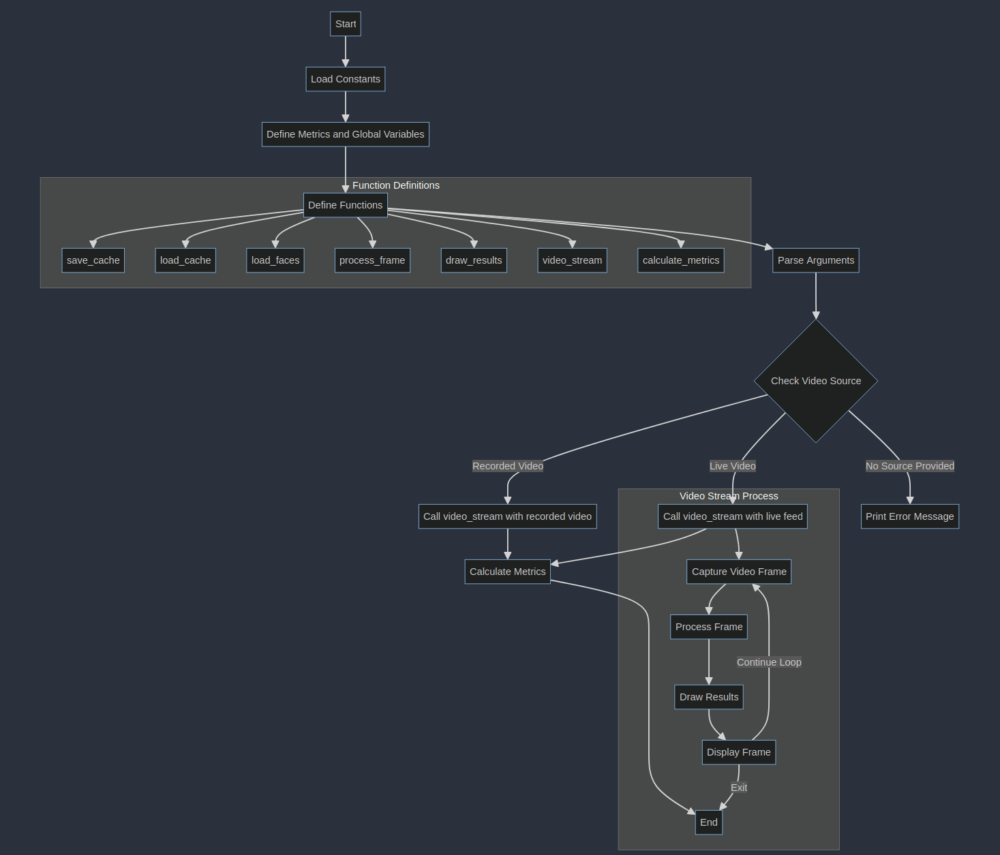
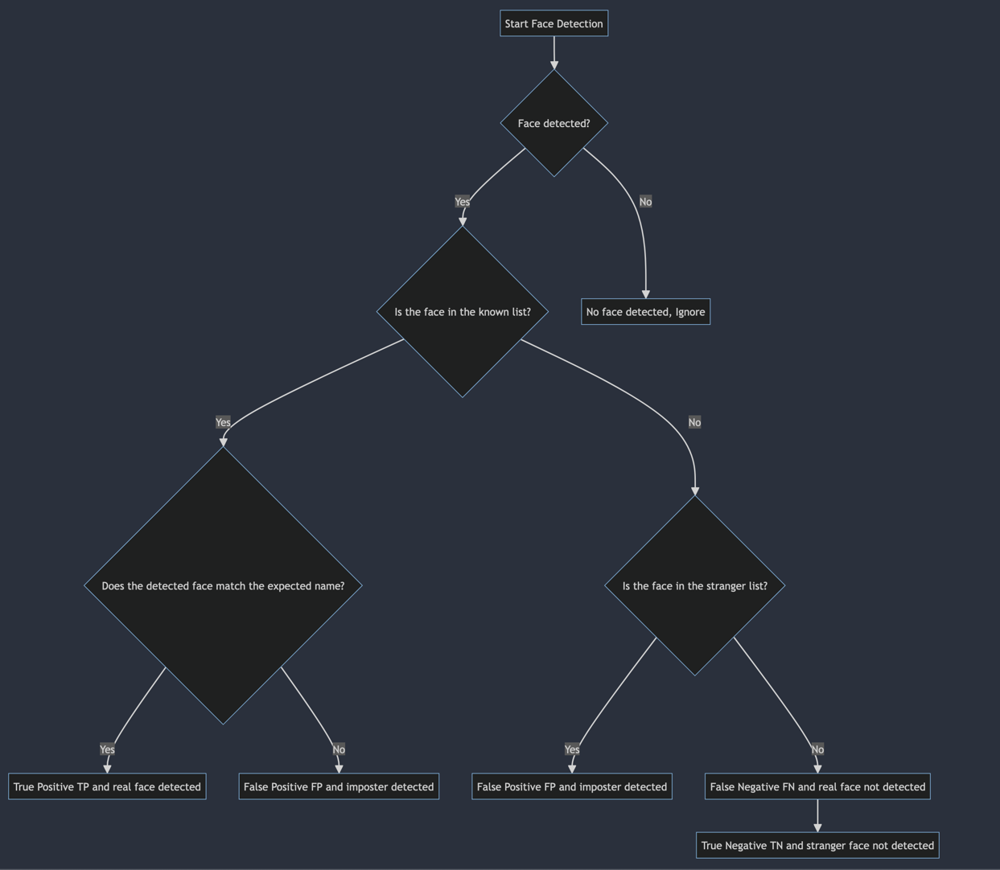
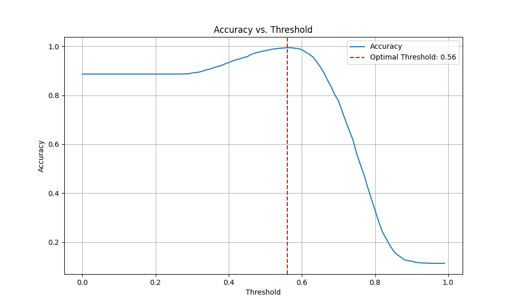
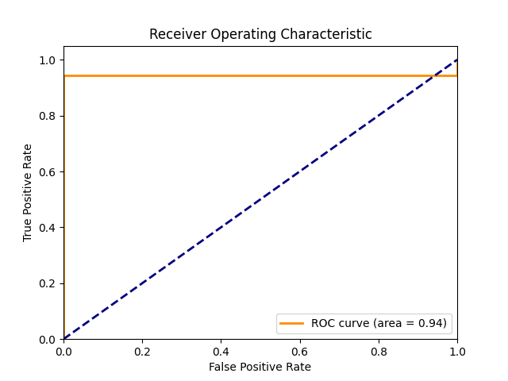

# face-detection-exercise


This project is a face detection and recognition system implemented in Python, using libraries such as OpenCV and Dlib for image processing and face recognition tasks. The system is designed to work with both live video feed and recorded videos.  

## Features
- Face detection and recognition from live video feed or recorded videos.
- Comparison of detected faces with a set of known faces and stranger faces.
- Calculation of various metrics such as True Positives (TP), False Positives (FP), True Negatives (TN), False Negatives (FN), and recall to evaluate the performance of the face recognition system.
- Calculation of the optimal threshold for face comparison.

## What you need

- Python 3.8 or lower
- Installation of python requirements
- A dataset of faces for reference and stranger images
- A base image from you
- A video file or a live video stream

### Installing the requirements
```
pip install -r requirements.txt
```
### Download the dataset
Download the dataset for faces from [here](https://sites.google.com/view/sof-dataset) and place it in the root directory under `/unknown_faces` with following commands:
```bash
curl -L -o unknown_faces.rar https://drive.usercontent.google.com/download?id=1ufydwhMYtOhxgQuHs9SjERnkX0fXxorO&export=download&authuser=0&confirm=t&uuid=91495fca-e7bd-48bf-a911-ff07c2646ddc&at=APZUnTU3Uyl0y9aioFBFdWB9V_zb%3A1716813980194
unrar x unknown_faces.rar unknown_faces/
```

## Usage
### 1. Extract faces from your images
```python
python3 extract_faces.py --images_path <path_to_images> --output_path <path_to_save_extracted_faces> --reference_image <path_to_reference_image>
```


### 2. Calculate the optimal threshold
```python
python3 calculate_threshold.py --reference_images <path_to_reference_images> --stranger_images <path_to_stranger_images> --base_image <path_to_base_image>
```


### 3. Face detection and recognition
#### For recorded videos
```python
python3 main.py --video_path <path_to_video>
```
#### For live videos
```python
python3 main.py --live --reference_images <path_to_reference_images>
```

## How it is working
**Calculation**



**Application logic**



## Tips
Rename files in a directory with a name and a counter:
```
#!/bin/bash
counter=1
for file in *; do
  if [ -f "$file" ]; then
    mv "$file" "f${counter}.jpg"
    ((counter++))
  fi
done
```

## Example Results
### Determine variables for face detection and recognition (determine_threshold.py)

- 223 faces have been recognized from 692 raw images from myself
- 1747 faces have been recognized from the downloaded dataset
- the optimal threshold is 0.56 with an accuracy of 0.9944162436548223
```
Loaded 223 faces from cache
Loaded 1747 faces from cache
Determined Optimal Threshold: 0.56 with Accuracy: 0.9944162436548223
True Positives: 216, True Negatives: 1743, False Positives: 4, False Negatives: 7
```
### Face detection and recognition from a video (main.py)
#### Test 1: using the optimal threshold 0.56



```
Loaded 223 faces from cache
Loaded 1747 faces from cache
Threshold:  0.56
TP: 139, FP: 1, TN: 0, FN: 5 recall 0.9652777777777778
--------------------------------------------------
Accuracy: 0.9586206896551724
False Acceptance Rate (FAR): 1.0
False Rejection Rate (FRR): 0.034722222222222224
False Match Rate (FMR): 1.0
False Non-Match Rate (FNMR): 0.034722222222222224
--------------------------------------------------
Total faces detected: 145
Imposters detected: 1
Real faces detected: 144
```


## License
[MIT](https://choosealicense.com/licenses/mit/)