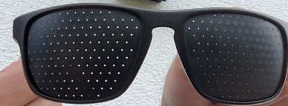
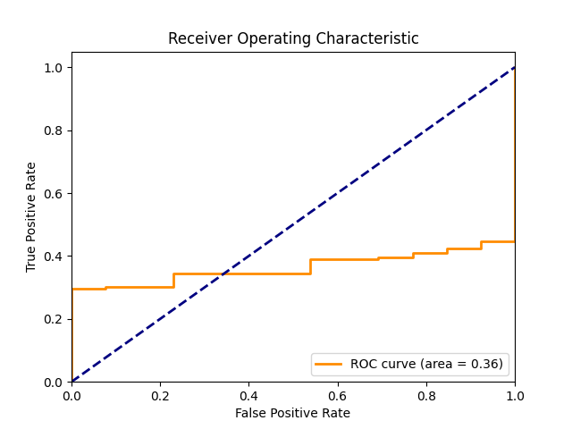
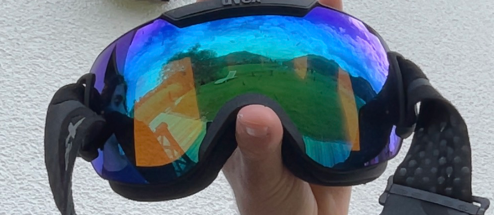
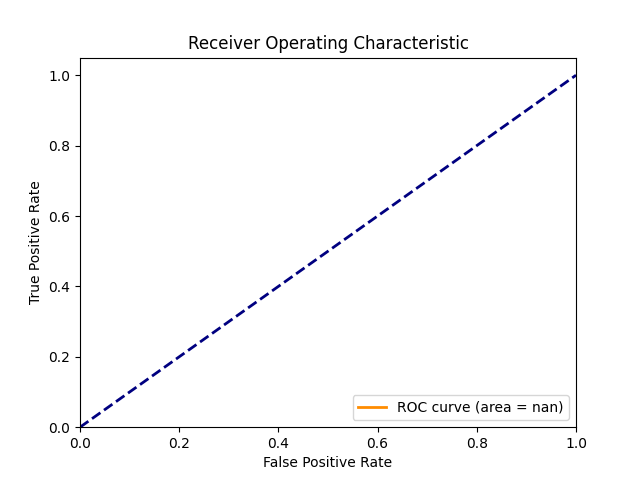
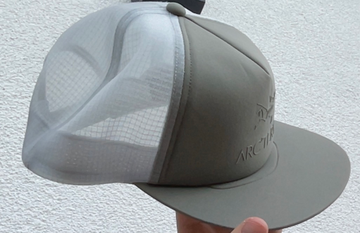

# face-detection-exercise


This project is a face detection and recognition system implemented in Python, using libraries such as OpenCV and Dlib for image processing and face recognition tasks. The system is designed to work with both live video feed and recorded videos.  

## Features
- Face detection and recognition from live video feed or recorded videos.
- Comparison of detected faces with a set of known faces and stranger faces.
- Calculation of various metrics such as True Positives (TP), False Positives (FP), True Negatives (TN), False Negatives (FN), and recall to evaluate the performance of the face recognition system.
- Calculation of the optimal threshold for face comparison.

## Get started
- Python 3.8 or lower
- Installation of python requirements
- A dataset of faces for reference and stranger images
- A base image from you
- A video file or a live video stream

### Installing the requirements
```
pip install -r requirements.txt
```
### Download the dataset
Download the dataset for faces from [here](https://sites.google.com/view/sof-dataset) and place it in the root directory under `/unknown_faces` with following commands:
```bash
curl -L -o unknown_faces.rar https://drive.usercontent.google.com/download?id=1ufydwhMYtOhxgQuHs9SjERnkX0fXxorO&export=download&authuser=0&confirm=t&uuid=91495fca-e7bd-48bf-a911-ff07c2646ddc&at=APZUnTU3Uyl0y9aioFBFdWB9V_zb%3A1716813980194
unrar x unknown_faces.rar unknown_faces/
```

## Usage
### 1. Extract faces from your images
```python
python3 extract_faces.py --images_path <path_to_images> --output_path <path_to_save_extracted_faces> --reference_image <path_to_reference_image>
```

### 2. Calculate the optimal threshold
```python
python3 calculate_threshold.py --reference_images <path_to_reference_images> --stranger_images <path_to_stranger_images> --base_image <path_to_base_image>
```

### 3. Face detection and recognition
#### For recorded videos
```python
python3 main.py --video_path <path_to_video>
```
#### For live videos
```python
python3 main.py --live --reference_images <path_to_reference_images>
```

## How it is working
**Application logic**


**Calculation**


## Results
### Determining the optimal threshold (determine_threshold.py)

**Output:**
```
Loaded 223 faces from cache
Loaded 1747 faces from cache
Determined Optimal Threshold: 0.56 with Accuracy: 0.9944162436548223
True Positives: 216, True Negatives: 1743, False Positives: 4, False Negatives: 7
```
**Analysis**
- 223 faces have been recognized from 692 raw images from myself (not every image a face could be extracted)
- 1747 faces have been recognized from the downloaded dataset (including strangers)
- the optimal threshold is 0.56 with an accuracy of 0.9944162436548223
### Face detection and recognition from a video (main.py)
#### Test 1: using the optimal threshold 0.56


**Output**
```
Loaded 223 faces from cache
Loaded 1747 faces from cache
Threshold:  0.56
TP: 139, FP: 1, TN: 0, FN: 5 recall 0.9652777777777778
--------------------------------------------------
Accuracy: 0.9586206896551724
False Acceptance Rate (FAR): 1.0
False Rejection Rate (FRR): 0.034722222222222224
False Match Rate (FMR): 1.0
False Non-Match Rate (FNMR): 0.034722222222222224
--------------------------------------------------
Total faces detected: 145
Imposters detected: 1
Real faces detected: 144
```

**Analysis**
- the optimal threshold 0.56 has been used
- tested it with a live video from myself (without face decoration or any tries to manipulate the results)
- 145 total faces has been recognized
  - 1 name of these faces was not the expected one, but still under the selected threshold, therefore it's an imposter
  - 144 has been recognized with the correct name

### Edges cases
### Case 1: Sunglasses



**Output**
```
Loaded 223 faces from cache
Loaded 1747 faces from cache
Threshold:  0.49
TP: 139, FP: 13, TN: 0, FN: 0, Recall: 1.0
--------------------------------------------------
Accuracy: 0.9144736842105263
False Acceptance Rate (FAR): 1.0
False Rejection Rate (FRR): 0.0
False Match Rate (FMR): 1.0
False Non-Match Rate (FNMR): 0.0
--------------------------------------------------
ROC AUC: 0.36413945766463757
Total faces detected: 152
Imposters detected: 13
Real faces detected: 139
```
**Analysis**
- the threshold 0.49 has been used
- there were a lot of imposter attempts (13) detected
  - most probably because of the sunglasses


### Case 2: Ski googles



**Output**
```
Loaded 223 faces from cache
Loaded 1747 faces from cache
Threshold:  0.49
TP: 0, FP: 0, TN: 0, FN: 0, Recall: 0
--------------------------------------------------
Accuracy: 0
False Acceptance Rate (FAR): 0
False Rejection Rate (FRR): 0
False Match Rate (FMR): 0
False Non-Match Rate (FNMR): 0
--------------------------------------------------
y_true and y_scores must not be empty for ROC calculation
Total faces detected: 0
Imposters detected: 0
Real faces detected: 0
```

**Analysis**
- the threshold 0.49 has been used
- 100% failure-to-acquire-rate (FTA)

### Case 3: Hat



**Output**
```
Loaded 223 faces from cache
Loaded 1747 faces from cache
Threshold:  0.49
TP: 305, FP: 0, TN: 0, FN: 0, Recall: 1.0
--------------------------------------------------
Accuracy: 1.0
False Acceptance Rate (FAR): 0
False Rejection Rate (FRR): 0.0
False Match Rate (FMR): 0
False Non-Match Rate (FNMR): 0.0
--------------------------------------------------
ROC AUC: nan
Total faces detected: 305
Imposters detected: 0
Real faces detected: 305
```

**Analysis**
- the threshold 0.49 has been used
- from 305 detected faces every face has been recognized correctly, so no imposter attempts detected
- so a according to these numbers a hat does not influence the recognition


## Disclaimer
The model chatgpt 4o has been used, to kickstart the program and for debugging purposes. Some prompts:

**Kickstart program (main.py)**
```
# i have the following requirements for a python project: 
Build a small program for face detection/recognition.
• Acquisition
‣ Collect some pictures of faces from your group, their family and/or friends.
‣ Use a video as input
‣ Use your webcam to do live face detection/recognition
# recommendations
• Use python
‣ OpenCV
‣ dlib
‣ face_recognition
# tasks for you 
- i want you to generate me code for this.
- if possible give me also a dockerfile, so i can run it os independently 
```

**Extract faces (extract_faces.py)**
```
regarding known_faces:
i have a lot of pictures from me, do you know how i can extract only the faces from the pictures? 
```

**Optimal threshold (determine_threshold.py)**
```
give me some help how i can achieve following things in python:
- it should determine the best threshold. i have a known_faces directory (pictures of me), a reference image, and stranger_images. 
- it should loop through the known_faces and calculate the similarity score 
- the threshold should be calculated afterwards, so the optimal one is determined
```

## License
[MIT](https://choosealicense.com/licenses/mit/)